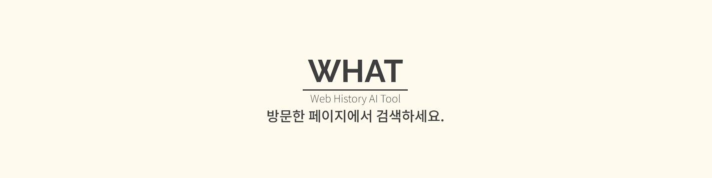
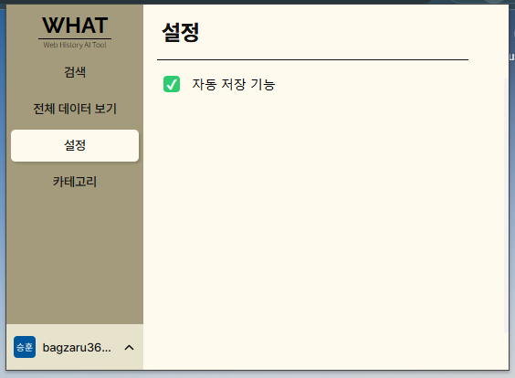
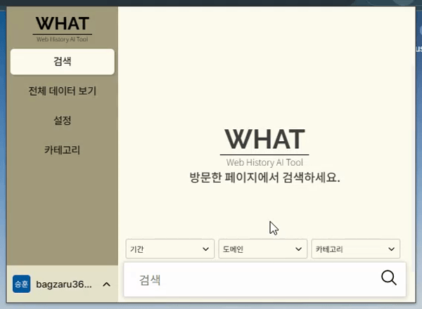
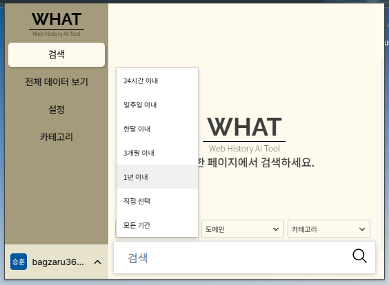
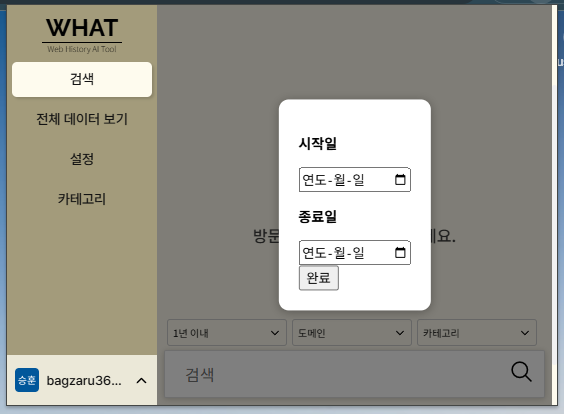
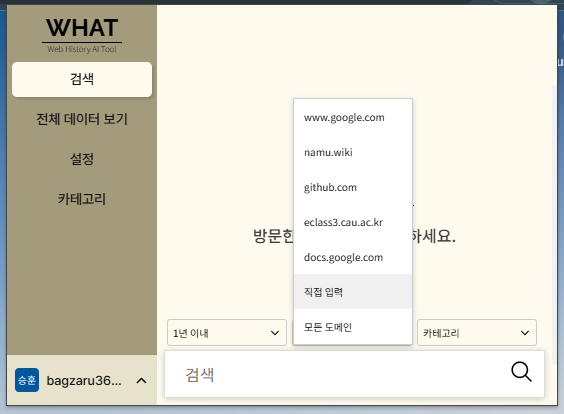
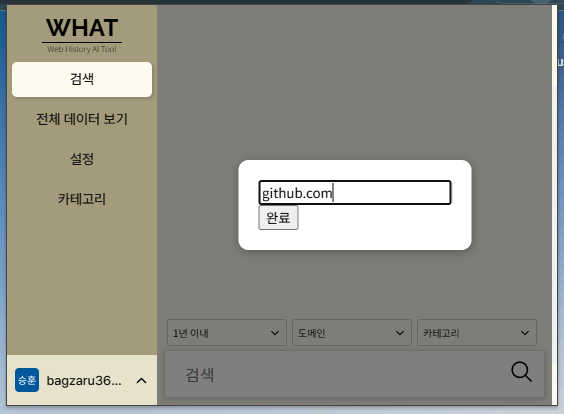
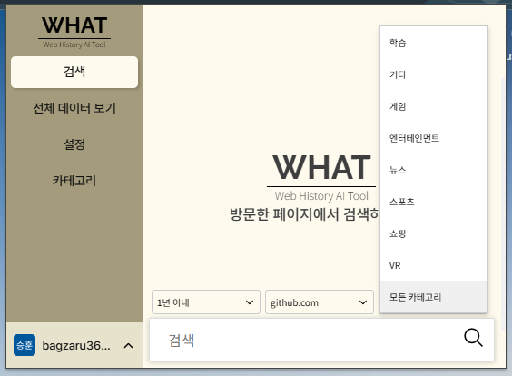

# WHAT: Web History AI Tool

WHAT은 LLM을 통해 방문했던 페이지를 빠르게 검색하고 확인할 수 있게 도와주는 Chrome 확장 프로그램입니다. 

# 소개

 | 
---|---|

방문한 페이지의 키워드를 LLM을 통해 벡터화하여 기록하고, 이를 기반으로 정확도 높은 방문 기록 검색 기능을 제공합니다. 또한 방문했던 페이지의 제목, 요약문, 주요 키워드를 자동으로 생성하고 미리 정의한 카테고리에 맞게 분류하여 이전에 방문했던 페이지를 빠르게 다시 확인하는데 도와줍니다.

# 설치 방법

### 1. 크롬 개발자 모드 켜기

### 2. 압축해제된 확장 프로그램을 로드 (clone한 메인 repo 선택)

### 3. 확장 프로그램을 상단에 고정하고 아이콘을 클릭

### 4. 로그인하여 시작 (로그인에는 사용자의 구글 계정이 필요합니다)

# 주요 기능 및 사용 방법

## 페이지 자동 저장 기능

설정에서 자동 저장 기능을 켜고 끌 수 있습니다.

자동 저장 기능이 켜져 있는 경우, 페이지를 방문할 때마다 데이터가 자동으로 저장됩니다.

<자동 저장 gif>

- 자동 저장에는 약 1초~10초의 지연 시간이 발생합니다.

자동 저장 기능이 꺼져 있는 경우, 저장하고자 하는 페이지에서 우클릭하여 수동으로 저장할 수 있습니다.

<수동 저장 gif>

## 전체 데이터 보기

### 1. 카테고리 분류

- 사용자가 정의한 카테고리 별로 데이터를 확인할 수 있습니다.

### 2. 사용자 정의 필터

- 사용자가 필터를 정의하고 적용 버튼을 누르면 조건을 만족하는 데이터만 추려낼 수 있습니다.
    - 기간 설정 (시작 날짜 ~ 종료 날짜)
    - 도메인 설정 (설정 한 기간 내에 가장 많이 방문한 순으로 10개 중 선택 또는 직접 입력)
    - 정렬 기준 (최근 방문순, 방문 횟수, 체류 시간)
    - 오름차순 또는 내림차순 정렬

### 3. 브라우저에서 열기

- 해당 데이터를 추출한 웹페이지의 URL을 브라우저에서 엽니다.

### 4. 카테고리

- 해당 페이지가 분류된 카테고리를 확인할 수 있습니다.

### 5. 삭제

- 해당 데이터를 삭제합니다.

### 6 ~ 9. WHAT에서 기록한 데이터

- 짧은 요약은 해당 페이지의 내용을 짧게 요약한 것으로, 전체 내용을 보려면 해당 데이터 블록을 클릭하면 펼쳐집니다.

### 10 ~ 12. 데이터 블록을 펼쳤을 때 보이는 데이터

- 데이터 블록을 펼치면 더 많은 데이터가 보입니다.

### 11. 긴 요약문 보기

- 페이지의 내용을 더 자세하게 나타낼 수 있는 긴 요약문을 표시합니다. 기존 짧은 요약문이 긴 요약문으로 대체되어 표시됩니다.

### 12. 카테고리 수정

- 사용자는 해당 데이터가 자동 배정된 카테고리가 마음에 들지 않으면, 직접 수정할 수 있습니다.

## 검색

WHAT의 검색 탭에서 저장된 페이지를 내용을 검색할 수 있습니다.

‘모든 기간’을 선택하여 방문했던 시간을 설정할 수 있습니다.

 | 
---|---|

- ‘직접 선택’을 클릭해 직접 입력할 수도 있습니다.
    

‘도메인’을 선택하여 특정 url에 대해서 검색할 수 있습니다.

 | 
---|---|
- 가장 많이 방문한 url 상위 5개를 보여줍니다.
- ‘직접 입력’을 눌러 도메인을 직접 입력할 수도 있습니다.

‘카테고리’를 선택하여 미리 지정한 카테고리 내에서 검색할 수 있습니다.

## 카테고리 페이지

### 1. 카테고리 목록

- 사용자는 이 페이지에서 카테고리를 수정할 수 있습니다.
- 텍스트 박스를 클릭하여 기존 카테고리의 이름을 수정하거나, X버튼을 눌러 삭제할 수 있습니다.
- 이 카테고리 목록을 기반으로 하여 데이터의 자동 분류가 수행됩니다.

### 2. 카테고리 추가

- 사용자는 원하는 카테고리가 있으면, 텍스트 박스에 추가할 이름을 입력하고, + 버튼 또는 엔터를 눌러 추가할 수 있습니다.
- 추가한 카테고리는 즉시 카테고리 목록에 표시됩니다.

### 3. 수정 사항 적용

- 사용자는 카테고리를 수정하고 수정 사항을 적용해야 합니다.
- 적용 버튼은 수정 사항이 없을 때는 비활성화 되어 있지만, 수정 사항이 있다면 활성화 됩니다
- 적용 버튼을 누를 시 수정 사항이 저장되고, 애플리케이션의 메인 페이지로 이동합니다.

# 라이센스

[LICENSE](./LICENSE)

이 프로젝트는 MIT 라이센스를 따릅니다.

다만, 일부 파일(`domDistiller.js`)의 출처는 [Chromium 프로젝트](https://www.chromium.org/)의 일부입니다. BSD 3-Clause 를 따르며 해당 파일 및 관련 라이센스 조항은 프로젝트 내 [LICENSE](./LICENSE) 파일에 포함되어 있습니다.
